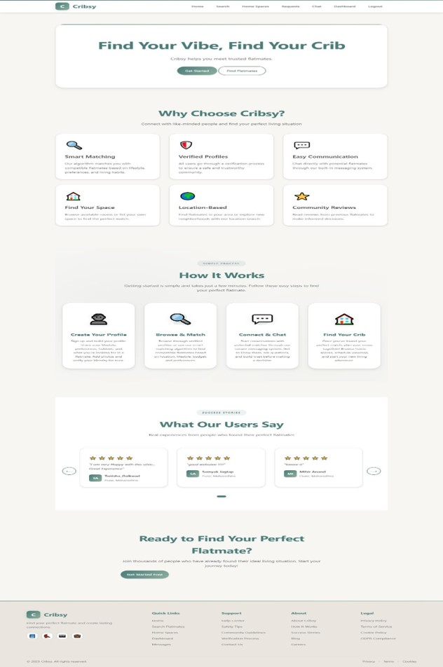
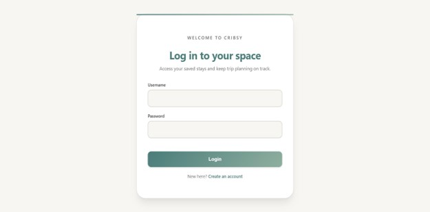
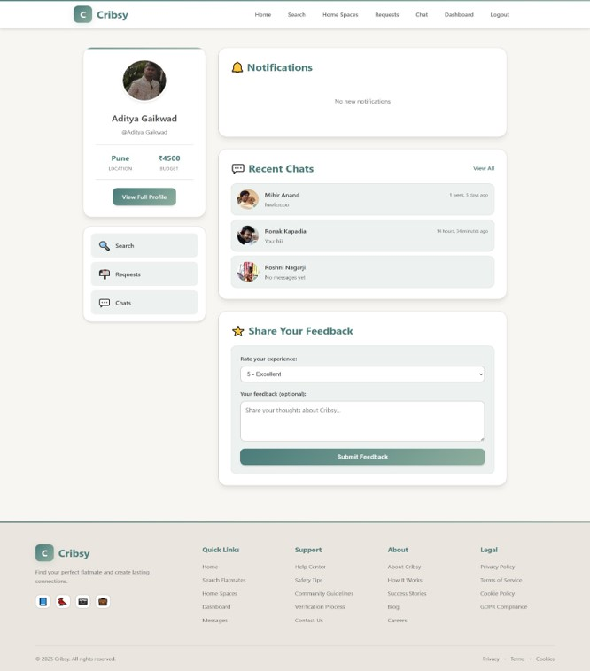
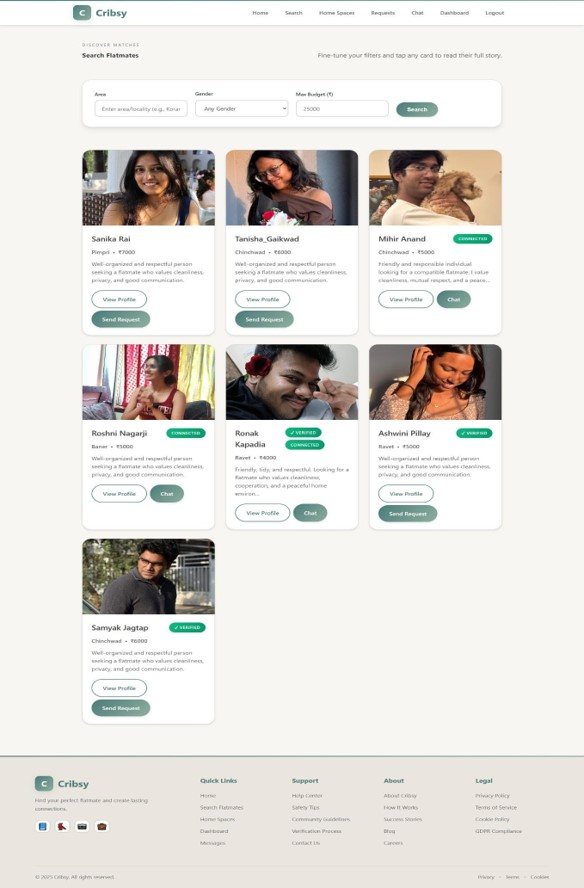
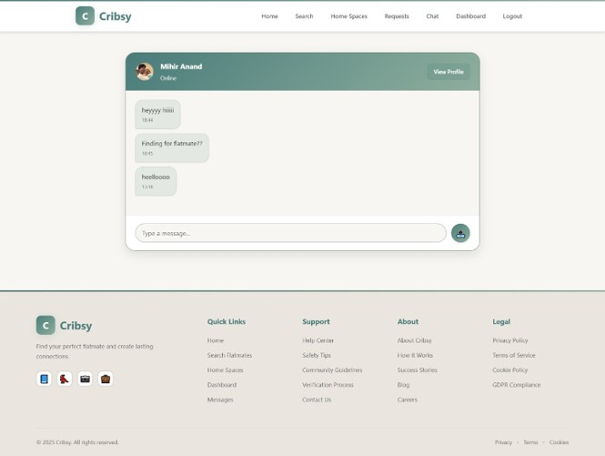
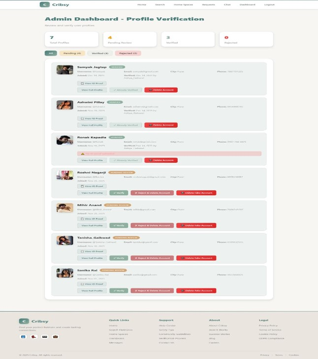

# Cribsy – Find Your Flatmate

## Overview

Cribsy is a Django-based web application that helps users find compatible flatmates and shared living spaces through verified profiles, home-space listings, request management, and direct communication.

## Features

- User Registration and Authentication
- Profile Management
- User Verification System
- Flatmate Search and Discovery
- Request Management
- One-to-One Chat
- Home Space Listings
- Property Photo Uploads
- Reviews and Feedback
- Admin Dashboard

## Screenshots

### Homepage


### Login Page


### User Profile


### Flatmate Search


### Chat System


### Admin Dashboard


## Technology Stack

**Frontend**
- HTML5
- CSS3
- JavaScript

**Backend**
- Python
- Django

**Database**
- SQLite3

## Installation

```bash
git clone https://github.com/sanika0517/Cribsy.git
cd Cribsy
pip install -r requirements.txt
python manage.py migrate
python manage.py runserver